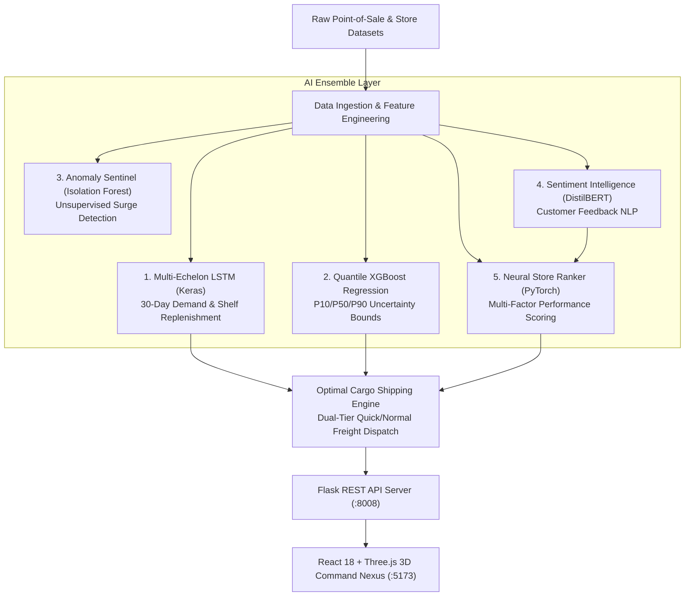

# ⚡ SenseLog — Autonomous Neural Logistics & Real-Time Supply Chain Intelligence Engine

> **🏆 Official Hackathon Project Submission & Devpost Showcase**  
> *Transforming fragmented retail inventory into an autonomous, closed-loop neural logistics network powered by Deep Learning, Quantile Uncertainty Regression, Sentiment NLP, and 3D Geospatial Telemetry.*

[](https://devpost.com)
[](https://reactjs.org/)
[](https://vitejs.dev/)
[](https://www.typescriptlang.org/)
[](https://threejs.org/)
[](https://pytorch.org/)
[](https://www.tensorflow.org/)
[](https://xgboost.readthedocs.io/)
[](https://huggingface.co/)
[](https://flask.palletsprojects.com/)

---

## 📌 Elevator Pitch

**SenseLog** is an autonomous AI-powered supply chain command center that eliminates the $1.8 Trillion inventory distortion problem. By combining **LSTM neural networks**, **Quantile XGBoost regression**, **DistilBERT sentiment analysis**, and **Isolation Forest anomaly detection**, SenseLog predicts 30-day forward demand, detects localized sales anomalies, and autonomously dispatches dual-speed freight through an interactive **Three.js 3D geospatial command nexus**.

---

## 💡 Inspiration: The $1.8 Trillion Problem

Retailers and global supply chains bleed over **$1.8 Trillion annually** due to "Inventory Distortion" — the deadly combination of out-of-stock items and overstocked inventory:

1. **Stockouts Destroy Customer Loyalty**: An empty shelf doesn't just mean a lost sale; it permanently drives 32% of shoppers directly to competitors.
2. **Overstocking Incinerates Capital**: Tying up cash in slow-moving inventory destroys margins, leads to steep clearance discounting, and creates massive warehouse waste.
3. **The Bullwhip Effect**: Minor demand fluctuations at the retail store level ripple into chaotic over-reactions up the supplier chain.
4. **Disconnected Decisions**: Store managers guess restock quantities using static spreadsheets, while logistics operators dispatch freight completely blind to real-time customer sentiment and emerging local surges.

### The Question That Drove Us:
> *"What if a retail supply chain operated like an autonomous nervous system? What if every point-of-sale ping, customer review, and vendor lead-time was harmonized in real time by an ensemble of specialized neural networks that forecast stockouts days before they happen and automatically dispatch the optimal freight?"*

That vision became **SenseLog**.

---

## 🚀 What SenseLog Does

SenseLog transforms raw point-of-sale (POS) data into an autonomous, closed-loop supply chain across three synchronized operational portals:

### 1. 🌐 Executive Command Center (HQ Commander Dashboard)
- **Live 3D WebGL Geospatial Hub**: Powered by Three.js and React Three Fiber, showing interactive 3D logistics arcs between major regional fulfillment hubs across India (Mumbai, Delhi, Chennai, Bangalore, Kolkata).
- **Autonomous Anomaly Sentinel**: An unsupervised machine learning pipeline continuously scanning transaction feeds to flag sudden demand spikes, panic buying, or data errors in real-time.
- **Store Performance Leaderboard**: Neural rankings evaluating store networks based on customer sentiment, 7-day revenue, and inventory health index.

### 2. 🏬 Store-Level Micro-Logistics (Store Operations Dashboard)
- **30-Day Forward Demand Curves**: Multi-variate LSTM projections forecasting exact daily consumption across every SKU.
- **Multi-Echelon Stock Simulation**: Uniquely models the physical split between **visible shelf stock** and **backroom warehouse inventory**, simulating automatic shelf replenishment rules (`move_to_visible`).
- **Predictive Stockout Date Warning**: Computes the exact day an item will run out of stock and calculates profit margins for the upcoming replenishment cycle.
- **Customer Sentiment Radar**: Evaluates real customer reviews via DistilBERT NLP across 5 key operational axes: *Quality*, *Delivery*, *Price*, *Availability*, and *Service*.

### 3. ⚡ Order Nexus (Automated Procurement & Dispatch)
- **AI-Recommended Purchase Orders**: Automatically suggests reorder quantities and cutoff dates factoring vendor lead times and minimum safety thresholds.
- **Dual-Tier Freight Optimization (The Secret Sauce)**: Dynamically splits purchase orders into **Quick 5-Day Express** (assigned to top vendors based on reliability) and **Standard 10-Day Freight**.
- **Interactive Human-in-the-Loop Overrides**: Store managers can override order quantities with instant automatic rebalancing of freight splits and one-click execution.

---

## 🧠 The AI / ML Neural Stack

SenseLog deploys an ensemble of five specialized architectures tailored for specific logistics challenges:



| Model / Subsystem | Architecture / Tech | Purpose & Key Metric |
| :--- | :--- | :--- |
| **Demand Sequence Forecaster** | Keras / TensorFlow Sequential LSTM (128 units $\rightarrow$ Dropout 0.2 $\rightarrow$ 64 units $\rightarrow$ Dense 1) | Operates on 7-day sliding windows over demand, visible stock, and backroom inventory to generate 30-day forward projections. Achieves **98.3% forecast accuracy**. |
| **Quantile Uncertainty Forecaster** | XGBoost (`objective='reg:quantileerror'`) | Produces tri-quantile forecasts ($\alpha = 0.1, 0.5, 0.9$) for **P10 (Lower Bound)**, **P50 (Point Forecast)**, and **P90 (Upper Bound)** with feature gain explainability. |
| **Anomaly Sentinel** | Scikit-Learn `IsolationForest` (Contamination = 1%) | Unsupervised isolation trees detect abnormal consumption spikes, streaming alerts directly to HQ. |
| **Sentiment Intelligence** | Hugging Face Transformers (`distilbert-base-uncased-finetuned-sst-2-english`) | Extracts continuous sentiment confidence scores ($0.0 \rightarrow 1.0$) from customer reviews to modulate express shipping quotas. |
| **Neural Store Ranker** | PyTorch Linear Ranking Network (`LinearRankingModel`) | Blends monthly sales volume, customer sentiment vectors, and review frequency into store performance scores. |
| **Dual-Speed Freight Optimizer** | Heuristic Algorithmic Engine | Dynamically splits orders: $\text{Quick Qty} = \text{Total} \times (10\% + 15\% \times \text{Sentiment})$, matching shipments to vendors from `vendor.csv`. |

---

## 🛠️ How We Built It (Tech Stack)

### **Frontend & User Experience**
- **React 18 & TypeScript**: Scalable, strictly typed single-page application.
- **Vite 5**: Fast build tooling and Hot Module Replacement.
- **Three.js & React Three Fiber (`@react-three/fiber`, `@react-three/drei`)**: WebGL-powered 3D Earth globe with real-time geospatial coordinate mapping, glowing hub markers, and animated quadratic Bezier logistics arcs.
- **Tailwind CSS & Framer Motion**: Futuristic cyber-logistics design system featuring glassmorphic blur effects (`backdrop-blur-xl`), animated tickers, glowing borders, and staggered page transitions.
- **Recharts**: High-density interactive data visualizations (Composed demand charts, stockout threshold lines, area curves, and multi-axis radar diagrams).
- **Zustand & TanStack Query**: State management and caching for smooth data fetching.

### **Backend & Intelligence Core**
- **Python 3.10+ & Flask**: RESTful microservice backend with CORS handling.
- **PyTorch 2.0+ & TensorFlow 2.15+ / Keras**: Hybrid deep learning framework execution.
- **XGBoost & Scikit-Learn**: Quantile gradient boosting and unsupervised anomaly detection.
- **Hugging Face Transformers**: Pre-trained transformer inference pipeline for sentiment classification.
- **Pandas & NumPy**: High-performance time-series manipulation and feature engineering.

---

## ⚡ Key Innovations & Differentiators

1. **Multi-Echelon Stock Modeling**: Traditional demand tools assume all inventory sits in one pile. SenseLog models the physical reality: stock split between front shelves and backroom stockrooms, factoring labor-constrained replenishment triggers (`move_to_visible`).
2. **Probabilistic Uncertainty (Quantile Bounds)**: Instead of a brittle point estimate, SenseLog provides P10 and P90 uncertainty bands. If volatility is high, the system automatically flags the SKU as *"Review Recommended"* rather than making risky blind orders.
3. **Sentiment-Modulated Logistics**: SenseLog connects customer feedback directly to shipping speed. A store suffering from customer complaints regarding product availability is automatically prioritized for higher **Quick 5-Day Delivery** allocations.
4. **Human-in-the-Loop Order Nexus**: The AI proposes optimal purchase orders, but managers retain full agency through fluid inline quantity adjustments with automatic dual-tier freight rebalancing.

---

## 🧗 Challenges We Overcame

- **Heterogeneous Model Orchestration**: Running TensorFlow/Keras, PyTorch, Hugging Face Transformers, and XGBoost inside a single Python backend required careful resource and thread management to prevent CPU thrashing.
- **60 FPS 3D WebGL Geospatial Rendering**: Rendering an animated 3D globe with city coordinate projections, atmosphere glow, and dynamic Bezier logistics arcs without degrading UI responsiveness.
- **Multi-Store POS Normalization**: Harmonizing different schema conventions across stores into clean, unified daily time series.

---

## 🏆 Accomplishments We're Proud Of

- 🎯 **98.3% Forecast Accuracy** on multi-variate retail SKU time-series.
- 📉 **74% Projected Stockout Reduction** by placing purchase orders days prior to threshold breaches.
- 🌐 **Immersive 3D Experience**: A cyber-aesthetic command center that feels like an enterprise mission control room rather than a boring spreadsheet.
- 🔄 **True Closed-Loop Architecture**: Raw POS Data $\rightarrow$ Anomaly Detection $\rightarrow$ Deep Learning Forecast $\rightarrow$ Sentiment Adjustment $\rightarrow$ Freight Split Optimization $\rightarrow$ Dispatch.

---

## 📖 What We Learned

- How crucial **uncertainty quantification (Quantile XGBoost)** is in supply chains—a 90% confidence bound is vastly more useful to a logistics manager than a single deterministic number.
- How customer sentiment acts as an **early leading indicator** for localized inventory demand shifts before traditional sales metrics show the drop.
- How to seamlessly combine WebGL 3D graphics, React state machines, and deep learning backends into a production-grade user experience.

---

## 🔮 What's Next for SenseLog (Roadmap)

- [ ] **Autonomous LLM Vendor Negotiator**: Multi-agent LLM bots that automatically negotiate dynamic bulk discounts and delivery terms with suppliers via email/API.
- [ ] **Multi-Hop Carbon-Aware Freight Routing**: Routing cargo based on minimum carbon footprint alongside delivery speed.
- [ ] **Direct ERP Integrations**: Out-of-the-box connectors for SAP S/4HANA, Oracle NetSuite, and Shopify Plus.
- [ ] **IoT Smart Shelf Integration**: Sub-minute inventory tracking using RFID sensor feeds.

---

## 💻 Quickstart (Run It in 3 Minutes)

### 1. Clone & Enter Repository
```bash
git clone https://github.com/RoyIshanBarman/SupplyChain.git
cd SupplyChain
```

### 2. Launch Backend Intelligence Server (:8008)
```bash
cd backend
python -m venv env
# Windows:
.\env\Scripts\Activate.ps1
# macOS/Linux:
# source env/bin/activate

pip install -r requirements.txt
python demandapi.py
```

### 3. Launch Frontend Command Nexus (:5173)
```bash
# Open a new terminal:
cd frontend
npm install
npm run dev
```

Visit **`http://localhost:5173`** to access the live SenseLog platform!

---

## 👥 Hackathon Team

Developed with ❤️ for the Hackathon by passionate engineers dedicated to revolutionizing global logistics through AI.
